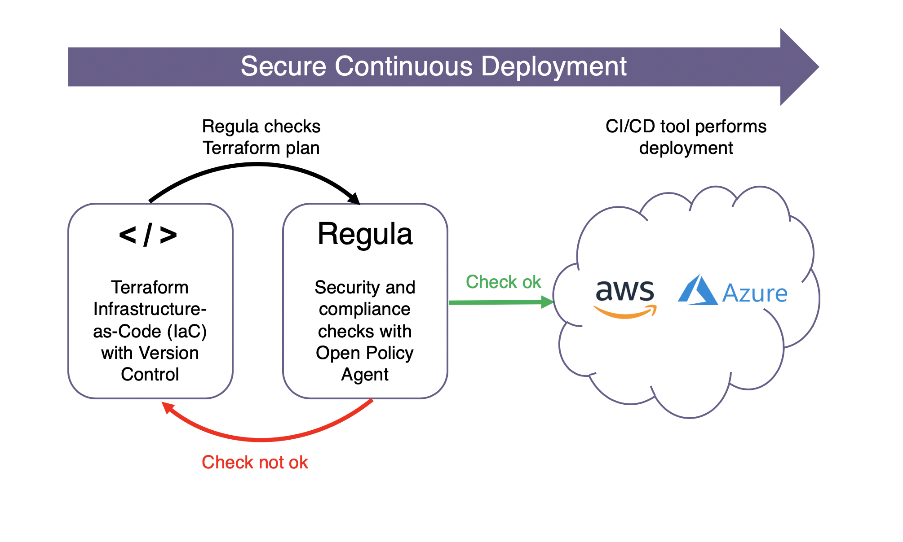

# Regula

-   [Introduction](#introduction)
-   [How does Regula work?](#how-does-regula-work)
-   [Rule library](#rule-library)
-   [Running Regula locally](#running-regula-locally)
-   [Regula rules](#regula-rules)
    -   [Simple rules](#simple-rules)
    -   [Custom error messages](#custom-error-messages)
    -   [Advanced rules](#advanced-rules)
    -   [Rule library](#rule-library)
    -   [Rule examples](#rule-examples)
-   [Compliance controls vs. rules](#compliance-controls-vs-rules)
    -   [Specifying compliance controls](#specifying-compliance-controls)
-   [Interpreting the results](#interpreting-the-results)
    -   [Summary](#summary)
    -   [Controls](#controls)
    -   [Rules](#rules)
-   [Running Regula in CI](#running-regula-in-ci)
-   [Running Regula with Conftest](#running-regula-with-conftest)
-   [Development](#development)
    -   [Directory structure](#directory-structure)
    -   [Adding a test](#adding-a-test)
    -   [Debugging a rule with fregot](#debugging-a-rule-with-fregot)
    -   [Locally producing a report](#locally-producing-a-report)
    -   [Locally producing a report on Windows](#locally-producing-a-report-on-windows)

## Introduction

Regula is a tool that evaluates Terraform infrastructure-as-code for potential AWS, Azure, and Google Cloud security misconfigurations and compliance violations prior to deployment.



Regula includes a library of rules written in Rego, the policy language used by the Open Policy Agent ([opa]) project. Regula works with your favorite CI/CD tools such as Jenkins, Circle CI, and AWS CodePipeline; we’ve included a [GitHub Actions example](https://github.com/fugue/regula-action) so you can get started quickly (see our blog post [here](https://www.fugue.co/blog/predeployment-compliance-checks-with-regula-and-terraform-blog)). Where relevant, we’ve mapped Regula policies to the CIS AWS, Azure, and GCP Foundations Benchmarks so you can assess your compliance posture. We'll be adding more rules in the coming weeks, sourced from [Fugue](https://fugue.co).

## How does Regula work?

There are two parts to Regula. The first is a [shell script](/bin/regula)
that generates a [terraform] plan or use existing in JSON format, ready for consumption by [opa].

The second part is a Rego framework that:

-   Merges resource info from `planned_values` and `configuration` in the
    Terraform plan into a more conveniently accessible format.
-   Walks through the imported Terraform modules and merges them into a flat
    format.
-   Looks for [rules](#regula-rules) and executes them.
-   Creates a report with the results of all rules and a
    [control mapping](#compliance-controls-vs-rules) in the output.

## Rule library

See [rules](https://github.com/fugue/regula/tree/master/rules) directory.  Fugue is currently working on open sourcing more rules from [our product](https://www.fugue.co/) to Regula.

| Provider | Service         | Rule Name                                   | Rule Summary                                                                                               |
|----------|-----------------|---------------------------------------------|------------------------------------------------------------------------------------------------------------|
| AWS      | CloudFront      | cloudfront\_distribution\_https             | CloudFront distributions should use HTTPS traffic                                                          |
| AWS      | CloudTrail      | cloudtrail\_log\_file\_validation           | CloudTrail log file validation should be enabled                                                           |
| AWS      | EBS             | ebs\_volume\_encrypted                      | EBS volume encryption should be enabled                                                                    |
| AWS      | IAM             | iam\_admin\_policy                          | IAM policies should not have full "*:*" administrative privileges                                          |
| AWS      | IAM             | iam\_user\_attached\_policy                 | IAM policies should not be attached directly to users                                                      |
| AWS      | KMS             | kms\_rotate                                 | KMS CMK rotation should be enabled                                                                         |
| AWS      | S3              | s3\_bucket\_sse                             | Server Side Encryption by default should be set for S3 buckets                                             |                                                                         |
| AWS      | VPC             | security\_group\_ingress\_anywhere          | VPC security group rules should not permit ingress from '0.0.0.0/0' except to ports 80 and 443             |
| AWS      | VPC             | security\_group\_ingress\_anywhere\_rdp     | VPC security group rules should not permit ingress from '0.0.0.0/0' to port 3389 (Remote Desktop Protocol) |
| AWS      | VPC             | security\_group\_ingress\_anywhere\_ssh     | VPC security group rules should not permit ingress from '0.0.0.0/0' to port 22 (SSH)                       |
| AWS      | VPC             | vpc\_flow\_log                              | VPC flow logging should be enabled                                                                         |
| GCP      | KMS             | kms\_cryptokey\_rotate                      | KMS crypto keys should be rotated at least once every 365 days                                             |
| GCP      | Compute         | compute\_firewall\_no\_ingress\_22          | VPC firewall rules should not permit ingress from '0.0.0.0/0' to port 22 (SSH)                             |
| GCP      | Compute         | compute\_firewall\_no\_ingress\_3389        | VPC firewall rules should not permit ingress from '0.0.0.0/0' to port 3389 (RDP)                           |
| GCP      | Compute         | compute\_subnet\_private\_google\_access    | VPC subnet 'Private Google Access' should be enabled                                                       |
| GCP      | Compute         | compute\_subnet\_flow\_log\_enabled         | VPC subnet flow logging should be enabled                                                                  |
| Azure    | Storage Account | storage\_account\_deny\_access              | Storage accounts should deny access from all networks by default                                           |
| Azure    | Storage Account | storage\_account\_microsoft\_services       | Storage accounts 'Trusted Microsoft Services' access should be enabled                                     |
| Azure    | Storage Account | storage\_account\_secure\_transfer          | Storage accounts 'Secure transfer required' should be enabled                                              |
| Azure    | Blob Storage    | storage\_container\_private\_access         | Storage containers should have access set to 'private'                                                     |
| Azure    | Virtual Network | network\_security\_group\_no\_inbound\_22   | Network security group rules should not permit ingress from '0.0.0.0/0' to port 22 (SSH)                   |
| Azure    | Virtual Network | network\_security\_group\_no\_inbound\_3389 | Network security group rules should not permit ingress from '0.0.0.0/0' to port 3389 (RDP)                 |
| Azure    | SQL Server      | sql\_server\_firewall\_no\_inbound\_all     | SQL Server firewall rules should not permit ingress from 0.0.0.0/0 to all ports and protocols              |

## Running Regula locally

Install the prerequisites:

- [OPA](https://www.openpolicyagent.org/docs/latest/#1-download-opa)
- [Terraform 0.12+](https://www.terraform.io/downloads.html)

### macOS and Linux

Run the following command:

    ./bin/regula [TERRAFORM_PATH] [REGO_PATHS...]

`TERRAFORM_PATH` is the directory where your Terraform configuration files are
located.

`REGO_PATHS` are the directories that need to be searched for Rego code.  This
should at least include `lib/`.

Some examples:

-   `./bin/regula ../my-tf-infra .`: conveniently check `../my-tf-infra` against
    all rules in this main repository.
-   `./bin/regula ../my-tf-infra.json .`: conveniently check `../my-tf-infra.json` terraform plan against
    all rules in this main repository.
-   `./bin/regula ../my-tf-infra lib examples/aws/ec2_t2_only.rego`: run Regula
    using only the specified rule.
-   `./bin/regula ../my-tf-infra lib ../custom-rules`: run Regula using a
    directory of custom rules.

It is also possible to set the name of the `terraform` executable, which is
useful if you have several versions installed:

    env TERRAFORM=terraform-v0.12.18 ./bin/regula ../regula-ci-example/ lib

Note that Regula requires Terraform 0.12+ in order to generate the JSON-formatted plan.

### Windows

Because Regula uses a bash script to automatically generate a plan, convert it to JSON, and run the Rego validations, Windows users can instead manually run the steps that Regula performs. See those steps [here](#locally-producing-a-report-on-windows).  Alternatively, you can run the script using [WSL](https://docs.microsoft.com/en-us/windows/wsl/about).

## Regula rules

Regula rules are written in standard [Rego] and use a similar format to
[Fugue Custom Rules]. This means there are (currently) two kinds of rules:
simple rules and advanced rules.

### Simple rules

Simple rules are useful when the policy applies to a single resource type only,
and you want to make simple yes/no decision.

```ruby
# Rules must always be located right below the `rules` package.
package rules.my_simple_rule

# Simple rules must specify the resource type they will police.
resource_type = "aws_ebs_volume"

# Simple rules must specify `allow` or `deny`.  For this example, we use
# an `allow` rule to check that the EBS volume is encrypted.
default allow = false
allow {
  input.encrypted == true
}
```

### Custom error messages

If you want to return more information to the user, you can also define a
custom error message.  This is done by writing a `deny[msg]` style rule.

```ruby
package rules.simple_rule_custom_message
resource_type = "aws_ebs_volume"

deny[msg] {
  not input.encrypted
  msg = "EBS volumes should be encrypted"
}
```

### Advanced rules

Advanced rules are harder to write, but more powerful. They allow you to
observe different kinds of resource types and decide which specific resources
are valid or invalid.

```ruby
# Rules still must be located in the `rules` package.
package rules.user_attached_policy

# Advanced rules typically use functions from the `fugue` library.
import data.fugue

# We mark an advanced rule by setting `resource_type` to `MULTIPLE`.
resource_type = "MULTIPLE"

# `fugue.resources` is a function that allows querying for resources of a
# specific type.  In our case, we are just going to ask for the EBS volumes
# again.
ebs_volumes = fugue.resources("aws_ebs_volume")

# Auxiliary function.
is_encrypted(resource) {
  resource.encrypted == true
}

# Regula expects advanced rules to contain a `policy` rule that holds a set
# of _judgements_.
policy[p] {
  resource = ebs_volumes[_]
  is_encrypted(resource)
  p = fugue.allow_resource(resource)
} {
  resource = ebs_volumes[_]
  not is_encrypted(resource)
  p = fugue.deny_resource(resource)
}
```

The `fugue` API consists of four functions:

-   `fugue.resources(resource_type)` returns an object with all resources of
    the requested type.
-   `fugue.allow_resource(resource)` marks a resource as valid.
-   `fugue.deny_resource(resource)` marks a resource as invalid.
-   `fugue.missing_resource(resource_type)` marks a resource as **missing**.
    This is useful if you for example _require_ a log group to be present.

### Rule examples

Whereas the rules included in the Regula rules [library](#rule-library) are generally applicable, we've built rule [examples](https://github.com/fugue/regula/tree/master/examples) that look at tags, region restrictions, and EC2 instance usage that should be modified to fit user/organization policies.

| Provider | Service | Rule Name             | Rule Description                                                                                |
|----------|---------|-----------------------|-------------------------------------------------------------------------------------------------|
| AWS      | EC2     | ec2\_t2\_only         | Restricts instances to a whitelist of instance types                                            |
| AWS      | IAM     | iam_password_length   | Requires IAM Password Policies with a certain minimum password length                           |
| AWS      | Tags    | tag\_all\_resources   | Checks whether resources that are taggable have at least one tag with a minimum of 6 characters |
| AWS      | Regions | useast1\_only         | Restricts resources to a given AWS region                                                       |

## Compliance controls vs. rules

What's the difference between controls and rules? A **control** represents an individual recommendation within a compliance standard, such as "IAM policies should not have full `"*:*"` administrative privileges" (CIS AWS Foundations Benchmark 1-22).

In Regula, a **rule** is a Rego policy that validates whether a cloud resource violates a control (or multiple controls). One example of a rule is [`iam_admin_policy`](https://github.com/fugue/regula/blob/master/rules/aws/iam_admin_policy.rego), which checks whether an IAM policy in a Terraform file has `"*:*"` privileges. If it does not, the resource fails validation.

Controls map to sets of rules, and rules can map to multiple controls. For example, control `CIS_1-22` and `REGULA_R00002` [both map to](https://github.com/fugue/regula/blob/master/rules/aws/iam_admin_policy.rego#L7) the rule `iam_admin_policy`.

### Specifying compliance controls
Controls can be specified within the rules: just add a `controls` set.

```ruby
# Rules must always be located right below the `rules` package.
package rules.my_simple_rule

# Simple rules must specify the resource type they will police.
resource_type = "aws_ebs_volume"

# Controls.
controls = {"CIS_1-16"}

# Rule logic
...
```

## Interpreting the results

Here's a snippet of test results from a Regula report. The output is from an example [GitHub Action](https://github.com/fugue/regula-ci-example/runs/389223751#step:4:12): 

```
{
  "result": [
    {
      "expressions": [
        {
          "value": {
            "controls": {
              "CIS_1-22": {
                "rules": [
                  "iam_admin_policy"
                ],
                "valid": false
              }
            },
            "rules": {
              "iam_admin_policy": {
                "resources": {
                  "aws_iam_policy.basically_allow_all": {
                    "id": "aws_iam_policy.basically_allow_all",
                    "message": "invalid",
                    "type": "aws_iam_policy",
                    "valid": false
                  },
                  "aws_iam_policy.basically_deny_all": {
                    "id": "aws_iam_policy.basically_deny_all",
                    "message": "",
                    "type": "aws_iam_policy",
                    "valid": true
                  }
                },
                "valid": false
              }
            },
            "summary": {
              "controls_failed": 2,
              "controls_passed": 12,
              "rules_failed": 2,
              "rules_passed": 8,
              "valid": false
            }
          },
          "text": "data.fugue.regula.report",
          "location": {
            "row": 1,
            "col": 1
          }
        }
      ]
    }
  ]
}
```

**These are the important bits:**

- Summary
- Controls
- Rules

### Summary

The `summary` block contains a breakdown of the compliance state of your Terraform files. In the output above, the Terraform violated 2 rules and 2 controls, so the test as a whole failed.

### Controls

Regula shows you compliance results for both controls and rules, in addition to which specific resources failed. Above, in the `controls` block, you can see that the Terraform in the example is noncompliant with `CIS_1-22`, and the mapped rules that failed are listed underneath (in this case, `iam_admin_policy`).

### Rules

In the `rules` block further down from `controls`, each rule lists the resources that failed. Above, you'll see that the resource `aws_iam_policy.basically_allow_all` was the one that failed the mapped rule -- as noted by `"valid": false`. In contrast, `aws_iam_policy.basically_deny_all` passed.

You can see the full example report in this [GitHub Action log](https://github.com/fugue/regula-ci-example/runs/389223751#step:4:12). For a detailed explanation of the report, see the [regula-ci-example README](https://github.com/fugue/regula-ci-example).

## Running Regula in CI

Regula is designed to be easy to run in CI.  We provide a GitHub Action that can
be easily added to your repository:

<https://github.com/fugue/regula-action>

Setting up Regula with different CI/CD solutions such as Jenkins, CodePipeline,
CircleCI, TravisCI, and others would follow a similar pattern.  This repository
contains an example:

<https://github.com/fugue/regula-ci-example>

## Running Regula with Conftest

[Conftest] is a test runner for configuration files that uses Rego for
policy-as-code.  Conftest supports Terraform; but policies need to be written
directly against the plan file which is often inconvenient and tricky.

Since Regula is just a Rego library; it works works seamlessly with Conftest.
This way you get the advantages of both projects, in particular:

 -  Easy CI integration and policy retrieval from Conftest
 -  Terraform plan parsing & the rule set from Regula

To use Regula with Conftest:

1.  Generate a `plan.json` using the following terraform commands:

        terraform init
        terraform plan -refresh=false -out=plan.tfplan
        terraform show -json plan.tfplan >plan.json

2.  Now, we'll pull the conftest support for Regula and the Regula library in.

        conftest pull -p policy/ github.com/fugue/regula/conftest
        conftest pull -p policy/regula/lib github.com/fugue/regula/lib

    If we want to use the [rules](#rule-library) that come with regula, we can
    use:

        conftest pull -p policy/regula/rules github.com/fugue/regula/rules

    And of course you can pull in your own Regula rules as well.

3.  As this point, it's simply a matter of running conftest!

        conftest test plan.json

## Development

### Directory structure

 -  `bin/`: the main Regula script that calls `terraform` & `opa`.
 -  `lib/`: the OPA library code to evaluate rules and mangle input.
 -  `rules/`: a collection of rules.  We may split this up further as the number
    of rules increases.
 -  `examples/`: a collection of example rules that you can use as inspiration
     for your own rules.
 -  `scripts/`: scripts for development; currently only a script to generate
    test input.
 -  `tests/`:
      *  `tests/lib`: internal tests for the library.
      *  `tests/rules/`: tests for the various rules.
      *  `tests/rules/inputs`: terraform files that can be used to generate Rego
         files.
      *  `tests/examples/`: tests for the example rules.
      *  `tests/examples/inputs`: input files for the example rules.

### Adding a test

If you would like to add a rule, we recommend starting with a test.
Put your terraform code in a file in `tests/rules/<provider>/inputs`; for example
[tests/rules/aws/inputs/kms\_rotate\_infra.tf](tests/rules/aws/inputs/kms_rotate_infra.tf).
From this, you can generate a mock input by running:

    bash scripts/generate-test-inputs.sh

The mock input will then be placed in a `.rego` file with the same name,
in our case [tests/rules/aws/inputs/kms\_rotate\_infra.rego](tests/rules/aws/inputs/kms_rotate_infra.rego).

Next, add the actual tests to a Rego file with the same name (appended with `_test` instead of `_infra`),
but outside of the `inputs/` subdirectory.  Using this example, that would be [tests/rules/aws/kms\_rotate\_test.rego](tests/rules/aws/kms_rotate_test.rego).

### Debugging a rule with fregot

Once you have generated the mock input, it is easy to debug a rule with
[fregot].  Fire up `fregot` with the right directories and set a breakpoint on
the rule you are trying to debug:

    $ fregot repl lib rules tests
    F u g u e   R E G O   T o o l k i t
    fregot v0.7.2 repl - use :help for usage info
    repl% :break data.rules.ec2_t2_only.allow

Now, we can just evaluate the entire report with the mock input.  If your rule
is triggered, that will drop you into a debug prompt:

    repl% data.fugue.regula.report with input as data.tests.rules.ec2_t2_only.mock_input
    19|   valid_instance_types[input.instance_type]
          ^^^^^^^^^^^^^^^^^^^^^^^^^^^^^^^^^^^^^^^^^

From here, you can evaluate anything in context; such as `input` to look at the
resource, or any other auxiliary rules such as `valid_instance_types` in this
example.

### Locally producing a report

In some cases (such as development and testing), you may want to manually reproduce the steps that Regula performs automatically.
If that is something you want to step through, this section is for you.

We first need to obtain a JSON-formatted terraform plan.  In order to do get
that, you can use:

    terraform init
    terraform plan -refresh=false -out=plan.tfplan
    terraform show -json plan.tfplan >input.json

This gives you `input.json`.  Now you can test this input against the rules by
evaluating `data.fugue.regula.report` with OPA.  In order to do that, point OPA
to the input file, and the regula project directory.

    opa eval -d /path/to/regula --input input.json 'data.fugue.regula.report'

Or using `fregot`:

    fregot eval --input input.json 'data.fugue.regula.report' . | jq

If all goes well, you should now see the results for each rule.

### Locally producing a report on Windows

To locally produce a Regula report on Windows, use the following steps:

1.  Generate a JSON-based terraform plan:

    ```
    .\terraform.exe init
    .\terraform.exe plan -refresh=false -out=infra
    .\terraform.exe show -json infra >infra.json
    ```

2. Run OPA against this input file:

    ```
    .\opa_windows_amd64.exe eval -i .\infra.json -d .\regula\lib\ -d .\regula\rules\ 'data.fugue.regula.report'
    ```

[opa]: https://www.openpolicyagent.org/
[fregot]: https://github.com/fugue/fregot
[terraform]: https://www.terraform.io/
[Rego]: https://www.openpolicyagent.org/docs/latest/policy-language/
[Fugue Custom Rules]: https://docs.fugue.co/rules.html
[Conftest]: https://github.com/instrumenta/conftest